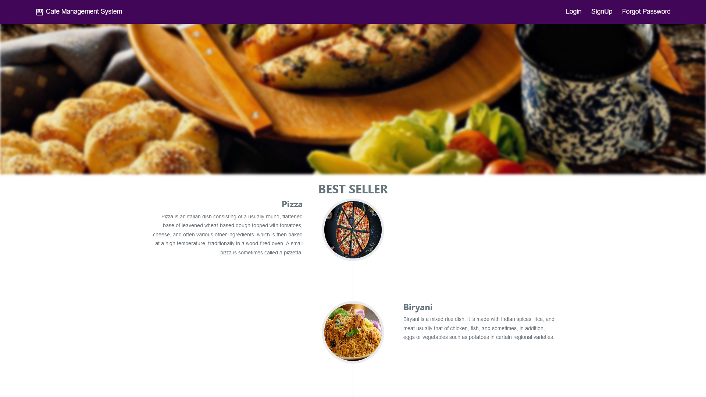
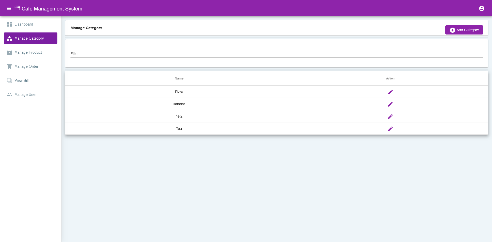
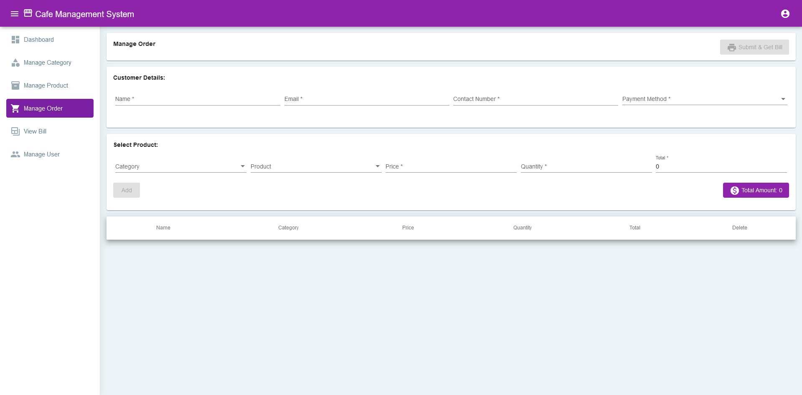

# CafeManagement

## Overview

CafeManagement is a cafe management system developed using Angular 11 on the front-end and Spring Boot 4 on the back-end. It offers a variety of functionalities to assist in the efficient administration of cafes. Below is a summary of the main features and pages of the system:

### Main Pages

1. **Login Page:** This page allows secure access to the system. Only authenticated users can access CafeManagement's features.

2. **Registration Page:** It enables new users to sign up for the system.

3. **Dashboard:** The dashboard provides summarized information about the cafe, including the number of categories, the total number of products, and the number of orders placed.

4. **Product Management:** On this page, users can add, edit, and remove products available in the cafe. Each product is characterized by details such as name, price, description, etc.

5. **Category Management:** Administrators can manage product categories on this page by adding, editing, and deleting categories as needed.

6. **Order Management:** Orders placed by customers are managed on this page, with detailed information about the order, including products, quantity, and status.

7. **Order View:** Authorized users can view all orders placed in the cafe, with the ability to filter and search.

8. **User Management:** This page is reserved for administrators, where they can add, edit, or delete users and assign specific roles.

### Project Images

here are some images for a more detailed view:

### Installation Requirements

Before installing CafeManagement on your machine, ensure that the following tools and technologies are installed:

- Angular 11
- Spring Boot 4

### How to Contribute

If you wish to contribute to the development of CafeManagement, follow these steps:

1. Fork this repository.
2. Clone your fork to your local machine.
3. Create a branch for your contribution: `git checkout -b your-feature`.
4. Make necessary changes and add meaningful commits.
5. Push the changes back to your GitHub repository.
6. Create a pull request to the main repository.
